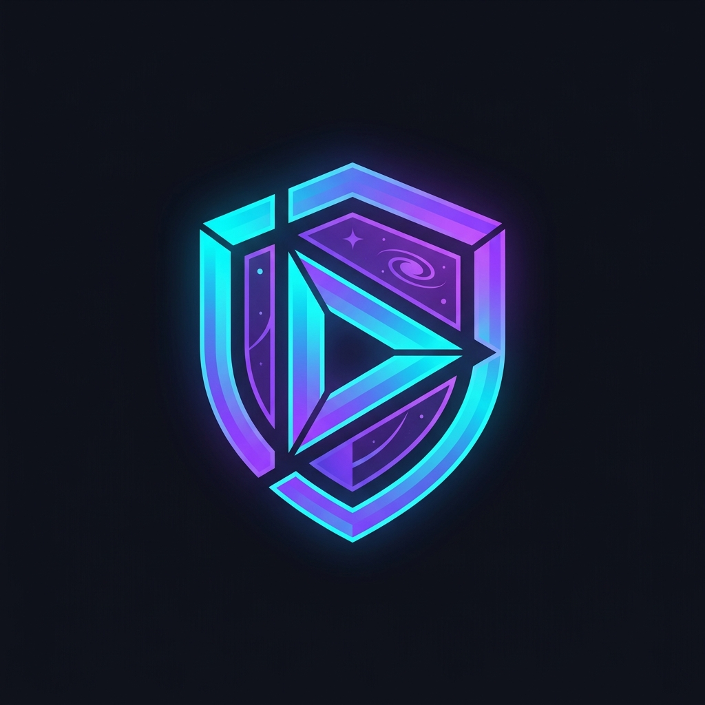

<div align="center">
  
  <h1>StreamSpace</h1>
  <p><strong>Plataforma Privada de Streaming Académico con Protección Anti-Piratería</strong></p>
</div>

---

## 🚀 Sobre el Proyecto

**StreamSpace** es una solución B2B diseñada para academias, creadores de contenido y educadores que requieren el más alto nivel de seguridad para sus videoclases. La plataforma asegura que el contenido en video solo sea consumido por estudiantes autorizados, mitigando activamente la piratería mediante la integración de DRM por hardware y marcas de agua dinámicas personalizadas.

## ✨ Características Principales

- 🛡️ **Protección de Grado Estudio (DRM)**: Integración nativa con VdoCipher para encriptación de video mediante Widevine y FairPlay, bloqueando descargas y capturas de pantalla no autorizadas.
- 💦 **Watermarking Dinámico**: Superposición en diagonal del correo del estudiante en tiempo real sobre el video, sirviendo como un fuerte elemento disuasorio contra la grabación por cámara externa.
- 🔐 **Autenticación Segura y RLS**: Gestión de sesiones robusta impulsada por Supabase Auth, respaldada por Políticas de Seguridad a Nivel de Fila (Row Level Security) en PostgreSQL.
- 👨‍💼 **Panel de Administración Inteligente**: 
  - Gestión completa del ciclo de vida de los estudiantes.
  - Asignación de tutoriales y cursos por alumno.
  - Revocación de accesos en un solo clic.
- ⚡ **Arquitectura Serverless**: Despliegue moderno dividiendo la responsabilidad de renderizado (Frontend) y generación de llaves criptográficas (Backend).

## 🛠️ Stack Tecnológico

**Frontend (Client-side)**
- React 19 + TypeScript
- Vite (Build Tool)
- Tailwind CSS v4 (Estilizado)
- Lucide React (Iconografía)
- TanStack Query (Gestión de estado asíncrono)
- React Router DOM (Enrutamiento)

**Backend (API & Auth)**
- Cloudflare Workers (Edge Computing)
- Hono (Web Framework ultra rápido)
- Supabase (PostgreSQL Database & Authentication)
- VdoCipher API (Video Hosting & DRM)

**Despliegue (Infraestructura)**
- Frontend: Vercel
- Backend: Cloudflare (Workers.dev)

## 🏗️ Arquitectura de Seguridad

La seguridad de reproducción se gestiona a través de un flujo de tres bandas:
1. El **Estudiante** solicita acceso a un video en el Frontend.
2. El **Frontend** solicita un token seguro al **Cloudflare Worker** validando su identidad con Supabase.
3. El **Worker** verifica la asignación y permisos en la base de datos y, si está autorizado, genera y retorna un OTP temporal utilizando las credenciales secretas de la API de VdoCipher.
4. El **Frontend** inicializa el reproductor seguro que desencripta el video en tiempo real.

Este diseño asegura que el `API_SECRET` de VdoCipher nunca llegue al navegador del cliente.

## 📦 Despliegue en Producción

### 1. Variables de Entorno (Vercel)
Para el despliegue del Frontend, se deben configurar las siguientes variables:
```env
VITE_SUPABASE_URL="tu_url_de_supabase"
VITE_SUPABASE_ANON_KEY="tu_anon_key"
VITE_WORKER_API_URL="tu_worker_en_cloudflare"
```

### 2. Secretos del Backend (Cloudflare)
El Worker requiere la inyección de los siguientes secretos mediante la CLI de Wrangler (`wrangler secret put`):
- `SUPABASE_URL`
- `SUPABASE_ANON_KEY`
- `SUPABASE_SERVICE_ROLE_KEY` (Para tareas de administrador)
- `VDOCIPHER_API_SECRET`
- `ALLOWED_ORIGIN` (URL del frontend para políticas CORS)

## 🤝 Soporte y Contacto
Proyecto desarrollado para uso privado y comercial. Para dudas sobre la implementación del esquema de base de datos o licenciamiento DRM, consultar con la administración técnica del repositorio.
